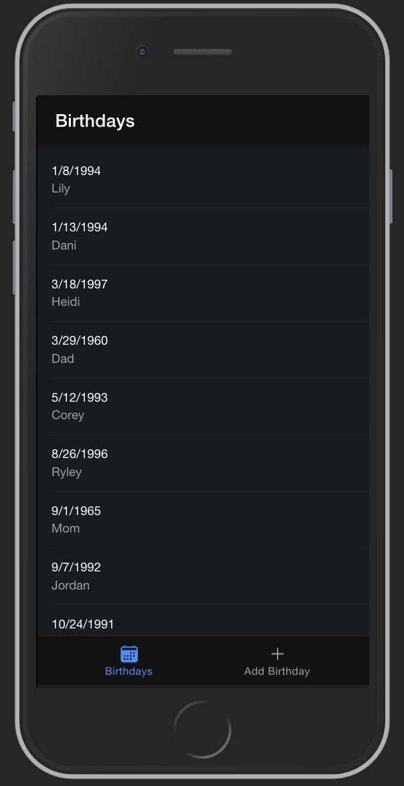
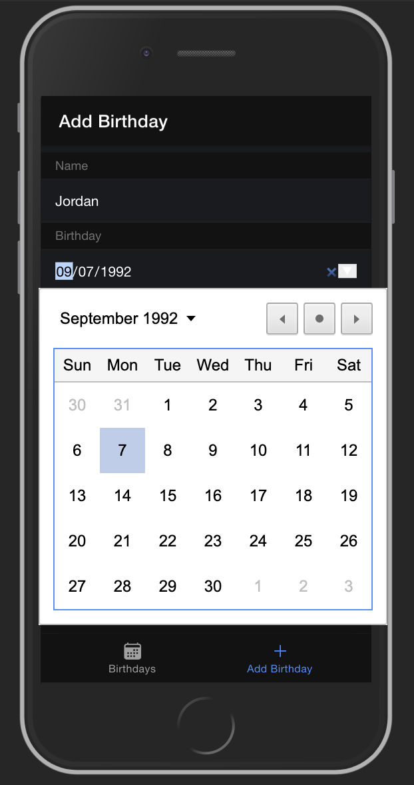

# Birthday Tracker
## Description
Duration: 1 Week Sprint

For this one week sprint, I built the Birthday Tracker app. This app is meant for people like me who are terrible at remembering when people's birthdays are. Users can have the names and birthdays of their close friends and family members all in one easy to access place, and never forget a birthday again. All information entered is stored locally in each user's browser. 

In the future, I would like to add authentication so that users can create a username and password. Once authentication is added, I will add a database to store each user's info so that they can access it on multiple devices. Lastly, I would like to add push-notifications to remind users when one of the saved birthdays is a week away.

## Deployed Website
(https://cloudburst-challenge-hayleyh.firebaseapp.com/)

## Screenshots

## Assumptions
Node.js installed
Using Visual Studio Code or other code editor

## Installation
fork and clone this repository to your own github and local computer
npm install 

## Usage
Begin adding birthdays by clicking "Add Birthday" at the bottom of the screen
Enter name and birthdate of person and submit
To view bithday list, click "Birthdays" tab at the bottom
If needed, swipe birthday to left to reveal delete option

## Built With
Microsoft Visual Studio Code
TypeScript
React
HTML
CSS
Node.js
Firebase
Ionic
MobX - for local storage of data

## Acknowledgment
Thank you to Cloudburst for giving me the opportunity to showcase my skills with this code challenge

## Support
If you have suggestions or issues, please email me at Luke.Schleder@gmail.com